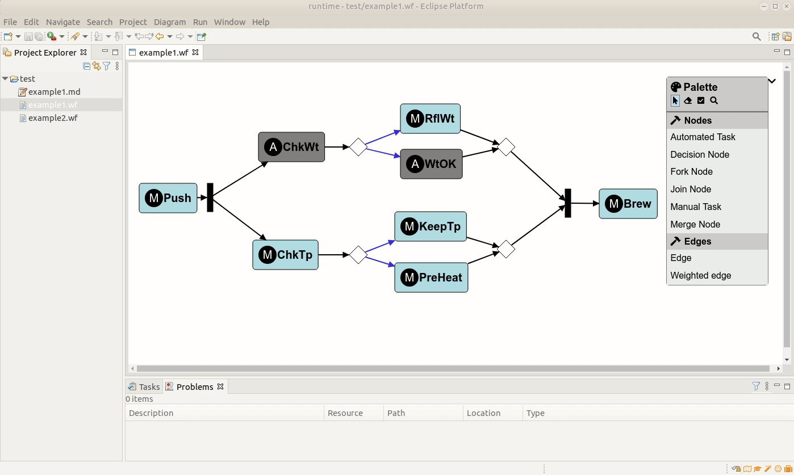

# Eclipse GLSP Eclipse IDE Integration webapp

Contains the client side glue code for opening browser-based GLSP diagrams in an Eclipse IDE editor as well as the workflow webapp example.
This project is available from npm via [@eclipse-glsp/ide](https://www.npmjs.com/package/@eclipse-glsp/ide).

## Building

To build this project locally, run `yarn` in this directory.

## More information
For more information, please visit the [Eclipse GLSP Umbrella repository](https://github.com/eclipse-glsp/glsp) and the [Eclipse GLSP Website](https://www.eclipse.org/glsp/). If you have questions, contact us on our [spectrum chat](https://spectrum.chat/glsp/) and have a look at our [communication and support options](https://www.eclipse.org/glsp/contact/).

